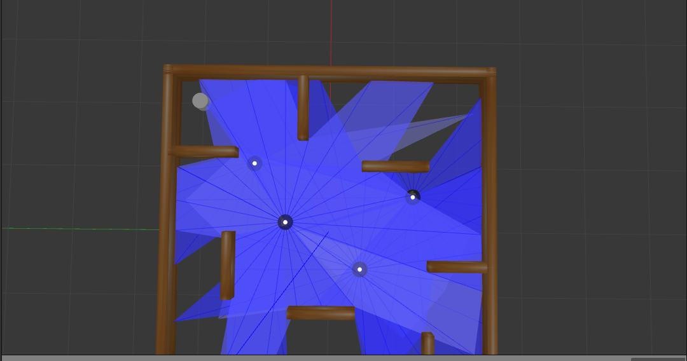

# Multi-Agent Reinforcement Learning for TurtleBot3 Using ROS2 Humble and Gazebo




## Overview
This project demonstrates multi-agent reinforcement learning (MARL) on TurtleBot3 robots in a ROS2 Humble and Gazebo environment. The workflow includes training a single TurtleBot agent using reinforcement learning (DQN) and then extending the model to multiple agents.

## Table of Contents
1. [Prerequisites](#prerequisites)
2. [Installation](#installation)
    - [Ubuntu Installation](#ubuntu-installation)
    - [ROS2 Installation](#ros2-installation)
    - [Dependent ROS2 Packages](#dependent-ros2-packages)
    - [TurtleBot3 Packages](#turtlebot3-packages)
3. [Environment Configuration](#environment-configuration)
4. [Setting Up Machine Learning](#setting-up-machine-learning)
5. [Running the Project](#running-the-project)
6. [Spawning Multiple agents](#spawning-multiple-agents)
7. [Project Workflow](#project-workflow)
8. [Troubleshooting](#troubleshooting)

---

## Prerequisites
- A PC with Ubuntu 22.04 LTS Desktop installed.
- Basic knowledge of ROS2, Gazebo, and Python.
- Familiarity with reinforcement learning concepts.

---

## Installation

### Ubuntu Installation
1. Download Ubuntu 22.04 LTS Desktop image from the official [Ubuntu website](https://ubuntu.com/download/desktop).
2. Follow the [Ubuntu installation guide](https://ubuntu.com/tutorials/install-ubuntu-desktop) to set up Ubuntu on your PC.

### ROS2 Installation
1. Install ROS2 Humble by following the [official ROS2 documentation](https://docs.ros.org/en/humble/Installation.html). The Debian package installation method is recommended for Linux users.

### Dependent ROS2 Packages
Install the required ROS2 packages for Gazebo, Cartographer, and Navigation2:

```bash
# Install Gazebo
sudo apt install ros-humble-gazebo-*

# Install Cartographer
sudo apt install ros-humble-cartographer
sudo apt install ros-humble-cartographer-ros

# Install Navigation2
sudo apt install ros-humble-navigation2
sudo apt install ros-humble-nav2-bringup
```

## TurtleBot3 Packages

### Create a Workspace and Clone the TurtleBot3 Repositories
To set up the TurtleBot3 packages, follow the steps below:

```bash
mkdir -p ~/turtlebot3_ws/src
cd ~/turtlebot3_ws/src/
git clone -b humble https://github.com/ROBOTIS-GIT/DynamixelSDK.git
git clone -b humble https://github.com/ROBOTIS-GIT/turtlebot3_msgs.git
git clone -b humble https://github.com/ROBOTIS-GIT/turtlebot3.git
sudo apt install python3-colcon-common-extensions
cd ~/turtlebot3_ws
colcon build --symlink-install
echo 'source ~/turtlebot3_ws/install/setup.bash' >> ~/.bashrc
source ~/.bashrc
```
## Environment Configuration
Set up the ROS environment:
```bash
echo 'export ROS_DOMAIN_ID=30 #TURTLEBOT3' >> ~/.bashrc
echo 'source /usr/share/gazebo/setup.sh' >> ~/.bashrc
source ~/.bashrc
```
## Setting Up Machine Learning
### 1. Clone the turtlebot3_machine_learning repository:
```bash
git clone https://github.com/ROBOTIS-GIT/turtlebot3_machine_learning.git
```
### 2. Install Python Libraries
Install necessary Python libraries such as TensorFlow, Keras, and other dependencies. You can use either Anaconda or pip for installation.

### 3. Configure Reinforcement Learning Parameters
Set the reinforcement learning parameters in the training script. By default:

- The agent receives a positive reward for moving closer to the goal.
- The agent receives a negative reward for moving away from the goal or colliding with obstacles.
- A large positive reward is given when the agent reaches the goal.
- A large negative reward is given upon collision with an obstacle.


## Running the Project
### Training a Single Agent

The training process is divided into four stages, each introducing increasing levels of complexity to the environment:
1. **Stage 1**: Plain environment without obstacles.
2. **Stage 2**: Environment with static obstacles.
3. **Stage 3**: Environment with moving obstacles.
4. **Stage 4**: Environment with both static and moving obstacles.

## Training in Stage 3 (Example)
To train the agent in Stage 3, follow the steps below:

### 1. Launch the Gazebo Environment
Start the Gazebo simulation for Stage 3:
```bash
ros2 launch turtlebot3_gazebo turtlebot3_dqn_stage3.launch.py
```
### 2. Spawning Goals in Gazebo
To spawn goals in the Gazebo environment for the TurtleBot3 training, use the following command:

```bash
ros2 run turtlebot3_dqn dqn_gazebo 3
```
The number 3 specifies the stage in which the goals are being spawned. Replace 3 with:
1 for Stage 1 (plain environment).
2 for Stage 2 (static obstacles).
3 for Stage 3 (moving obstacles).
4 for Stage 4 (combined moving and static obstacles).

### 3. Launch the DQN Environment
Start the DQN environment:
```bash
ros2 run turtlebot3_dqn dqn_environment
```
### 4. Start the DQN Agent
Begin training the agent in Stage 3:
```bash
ros2 run turtlebot3_dqn dqn_agent 3
```
### Training in Other Stages
To train in other stages, replace 3 with the desired stage number (1, 2, or 4) in the commands above. For example, to train in Stage 1:
```bash
ros2 launch turtlebot3_gazebo turtlebot3_dqn_stage1.launch.py
ros2 run turtlebot3_dqn dqn_gazebo 1
ros2 run turtlebot3_dqn dqn_environment
ros2 run turtlebot3_dqn dqn_agent 1
```

## Spawning Multiple agents
To spawn multiple TurtleBots in the Gazebo environment, the simulation file in the `turtlebot3_simulations` package was modified. The updated code allows multiple robots to be spawned in a grid layout. Below is the modified code:
```python
import os
from ament_index_python.packages import get_package_share_directory
from launch import LaunchDescription
from launch_ros.actions import Node
from launch.event_handlers import OnProcessExit
from launch.actions import RegisterEventHandler

def generate_launch_description():
    ld = LaunchDescription()

    # Configuration for the TurtleBot3 model
    TURTLEBOT3_MODEL = os.environ.get('TURTLEBOT3_MODEL', 'burger')
    model_folder = f'turtlebot3_{TURTLEBOT3_MODEL}'
    urdf_path = os.path.join(
        get_package_share_directory('turtlebot3_gazebo'),
        'models',
        model_folder,
        'model.sdf'
    )

    # Parameters for spawning robots
    num_columns = 2  # Number of columns in the grid
    num_rows = 2  # Number of rows in the grid
    num_robots = num_columns * num_rows  # Total number of robots calculated from rows and columns

    x_spacing = 1.0  # Horizontal spacing between robots
    y_spacing = 1.0  # Vertical spacing between robots

    # Calculate center offset for equal distribution
    x_offset = -((num_columns - 1) * x_spacing) / 2
    y_offset = -((num_rows - 1) * y_spacing) / 2

    last_spawn_action = None

    for i in range(num_robots):
        name = f'turtlebot{i}'
        namespace = f'/robot{i}'

        # Calculate grid position
        column = i % num_columns
        row = i // num_columns

        x_position = x_offset + (column * x_spacing)
        y_position = y_offset + (row * y_spacing)

        spawn_robot = Node(
            package='gazebo_ros',
            executable='spawn_entity.py',
            arguments=[
                '-file', urdf_path,
                '-entity', name,
                '-robot_namespace', namespace,
                '-x', str(x_position),
                '-y', str(y_position),
                '-z', '0.01'
            ],
            output='screen'
        )

        state_publisher = Node(
            package='robot_state_publisher',
            namespace=namespace,
            executable='robot_state_publisher',
            output='screen',
            arguments=[urdf_path]
        )

        # Sequential spawning to avoid conflicts
        if last_spawn_action:
            ld.add_action(RegisterEventHandler(
                event_handler=OnProcessExit(
                    target_action=last_spawn_action,
                    on_exit=[spawn_robot, state_publisher]
                )
            ))
        else:
            ld.add_action(spawn_robot)
            ld.add_action(state_publisher)

        last_spawn_action = spawn_robot

    return ld

```
## Loading the Trained Model to New Agents

In multi-agent reinforcement learning, once an agent is trained in the environment, the learned model can be reused for additional agents being added to the environment. This process helps in transferring knowledge, speeding up the training process, and ensuring that new agents start with a baseline understanding of the task.

### Concept Overview

1. **Pre-Trained Model**:
   - The trained model from a single agent is a neural network that has learned to map the agent's state to optimal actions for achieving the goal.
   - This model includes parameters (weights and biases) that represent the agent's policy for navigating the environment.

2. **New Agents**:
   - When new agents are introduced to the environment, they can start with the pre-trained model instead of learning from scratch.
   - This ensures that the new agents have a functional policy that allows them to perform basic navigation and task completion.

3. **Benefits**:
   - **Faster Training**: New agents already have a foundation to build upon, reducing the time needed for them to learn complex behaviors.
   - **Consistency**: Ensures all agents operate under a similar policy, reducing variability in behavior.
   - **Scalability**: Facilitates the addition of more agents without significant computational overhead for training.

### Steps for Loading the Trained Model

1. **Save the Trained Model**:
   - After training the first agent, save the model's weights to a file (e.g., `trained_model.h5`).

2. **Load the Model for New Agents**:
   - In the environment setup for new agents, load the saved model weights into the neural network.
   - This can be achieved using frameworks like TensorFlow or PyTorch. For example:
     ```python
     from tensorflow.keras.models import load_model

     # Load the trained model
     model = load_model('trained_model.h5')
     ```

3. **Assign the Model to New Agents**:
   - Initialize the new agents with the loaded model, enabling them to start using the pre-trained policy.

4. **Fine-Tuning (Optional)**:
   - Allow new agents to continue learning in the environment to adapt to any changes or additional complexities introduced with more agents.

### Application in the TurtleBot3 Multi-Agent Environment

- **Single-Agent Training**:
  - Train a single TurtleBot3 in the environment using stages (e.g., plain, static obstacles, moving obstacles, combined obstacles).
  - Save the trained model after successful training.

- **Adding New Agents**:
  - When introducing additional TurtleBots, initialize their neural networks with the saved model.
  - Launch the multi-agent environment and assign the loaded model to the new agents.

# Main Classes 

## `DQNEnvironment` Class

### Overview
The `DQNEnvironment` class extends the `Node` class in ROS 2 and defines the environment for an individual agent in the simulation. Each instance of the class corresponds to one robot agent, managing its state, interactions, and communication within the simulation.

---

### Constructor: `__init__(self, agent_id)`

#### Parameters:
- `agent_id` (int): Unique identifier for the agent.

#### Description:
Initializes variables, ROS publishers, subscribers, services, and logging mechanisms. 

#### Key Variables:
- **Agent and Goal Variables:**
  - `self.agent_id`: Unique ID of the agent.
  - `self.goal_pose_x`, `self.goal_pose_y`: Coordinates of the current goal.
  - `self.goal_distance`, `self.goal_angle`: Distance and angle to the goal.

- **State Variables:**
  - `self.scan_ranges`: Stores laser scan data.
  - `self.min_obstacle_distance`, `self.min_obstacle_angle`: Minimum distance and angle to obstacles.

- **Counters:**
  - `self.goal_count`, `self.collision_count`, `self.episode_count`:
    Track goals achieved, collisions encountered, and episodes completed.

- **Logging:**
  - `self.log_file`: Path to the CSV log file for storing performance metrics.

#### ROS Communication:
- **Publishers:**
  - `self.cmd_vel_pub`: Publishes velocity commands to the robot.

- **Subscribers:**
  - `self.goal_pose_sub`: Subscribes to goal position updates.
  - `self.odom_sub`: Subscribes to odometry data for robot localization.
  - `self.scan_sub`: Subscribes to laser scan data for obstacle detection.

- **Services:**
  - `self.task_succeed_client`, `self.task_fail_client`: Notify task completion or failure.
  - `self.dqn_com_server`: Handles communication with the DQN agent.

---

### Core Functions

#### `goal_pose_callback(self, msg)`
Processes incoming goal pose messages and updates goal coordinates.

#### `odom_callback(self, msg)`
Processes odometry messages and calculates the robot's distance and angle to the goal.

#### `scan_callback(self, msg)`
Processes laser scan messages and identifies the nearest obstacle's distance and angle.

#### `get_state(self)`
Computes and returns the current state of the agent, including:
- Goal distance
- Goal angle
- Minimum obstacle distance
- Minimum obstacle angle

Handles success and failure conditions:
- **Success:** Reaches goal within 0.2m.
- **Failure:** Collides with an obstacle or times out after 500 steps.

#### `get_reward(self, action)`
Computes the reward for the agent based on its actions and environment state:
- **Yaw Reward:** Encourages alignment with the goal.
- **Distance Reward:** Rewards proximity to the goal.
- **Obstacle Penalty:** Penalizes proximity to obstacles.
- **Success/Failure Reward:** Additional reward/penalty for reaching the goal or failing.

#### `log_data(self)`
Logs cumulative performance data (goals, collisions, etc.) to a CSV file every few episodes.

#### `reset(self)`
Resets the agent's internal state for a new episode.

#### `dqn_com_callback(self, request, response)`
Handles requests from the DQN agent to execute actions and provides the resulting state, reward, and termination status.

#### `euler_from_quaternion(self, quat)`
Converts quaternion orientation to Euler angles for easier computation.

---

### Main Function

#### `main(args=None)`
Creates and executes multiple `DQNEnvironment` nodes using a `MultiThreadedExecutor`. Adjust the number of agents by modifying the loop in the `main` function.

---

## `DQNGazebo` Class

### Overview
The `DQNGazebo` class provides a framework for integrating Deep Q-Network (DQN) reinforcement learning within a ROS2 and Gazebo simulation environment. This class is designed to manage multi-agent scenarios, dynamically spawn goals, and facilitate interactions between agents and their surroundings.

### Key Features

#### 1. Initialization
- **Stage and Agent Configuration**: Initializes the simulation stage and the number of agents participating in the environment.
- **Goal Management**: Sets up paths to predefined goal models and initializes goal positions and entity names for each agent.
- **State Variables**: Tracks initialization status to ensure the environment is set up correctly before operation.

#### 2. ROS2 Integration
- **Publishers**: Publishes goal poses for each agent to designated ROS2 topics.
- **Service Clients**: Manages interactions with simulation services to reset the environment, spawn entities, and delete entities as needed.
- **Service Servers**: Dynamically creates services for each agent to handle task success and failure events, enabling agents to communicate their status.

#### 3. Goal Management
- **Dynamic Goal Generation**: Creates unique random positions for agent goals within specified boundaries, ensuring diverse and realistic objectives.
- **Entity Management**: Handles the spawning and deletion of goal entities in the Gazebo environment to reflect the current state of the simulation.

#### 4. Real-Time Updates
- **Publish Timer**: Periodically publishes goal poses for agents and spawns corresponding entities in the simulation.
- **Environment Initialization**: Ensures that the simulation environment is reset and initialized correctly at the start, including deleting old entities and resetting the simulation state.

#### 5. Task Handling
- **Task Success Callback**: Responds to task completion events by deleting existing goals and generating new ones, allowing agents to progress to new objectives.
- **Task Failure Callback**: Resets the simulation environment and generates new goals to provide agents with fresh challenges after a failure.

#### 6. Simulation Control
- **Reset Simulation**: Sends requests to reset the simulation, ensuring a clean slate for continued training or testing.
- **Delete Entities**: Removes existing goal entities from the simulation to avoid conflicts with new goals.
- **Spawn Entities**: Dynamically spawns goal entities at specified positions, ensuring that each agent has a unique and visible target.

### Summary
The `DQNGazebo` class bridges the gap between reinforcement learning algorithms and robotic simulations in ROS2 and Gazebo. By managing multiple agents, dynamic goals, and real-time updates, it creates a robust platform for testing and training reinforcement learning agents in a controlled yet dynamic environment.

---


## `DQNAgent` Class

### Overview
The `DQNAgent` class is designed to implement a Deep Q-Network (DQN) for reinforcement learning in a ROS2 environment. This agent interacts with a simulation, learns optimal actions through experience, and updates its policy over time. It handles state transitions, action selection, and model training to achieve a predefined objective.

### Key Features

#### 1. Initialization
- **Stage Management**: Initializes the simulation stage and associated parameters.
- **Hyperparameters**: Defines DQN-specific parameters like discount factor, learning rate, and exploration parameters (epsilon).
- **Replay Memory**: Sets up a memory buffer for experience replay to improve sample efficiency.
- **Model Setup**: Builds the primary and target neural network models used for action evaluation and updates.

#### 2. ROS2 Integration
- **Service Clients**: Establishes ROS2 service clients to interact with the simulation environment, sending actions and receiving feedback.
- **Logging**: Configures logging for tracking episode performance and debugging purposes.

#### 3. Action Selection
- **Exploration vs. Exploitation**: Balances random exploration and model-driven exploitation based on the current epsilon value.
- **Action Decision**: Uses the neural network to predict Q-values and select the action with the highest value.

#### 4. Training
- **Experience Replay**: Samples past experiences from replay memory to train the model, breaking temporal correlations and improving stability.
- **Batch Updates**: Updates the neural network weights using mini-batches of experience.
- **Target Model Updates**: Periodically synchronizes the target model with the primary model to stabilize learning.

#### 5. Simulation Process
- **State-Action Loop**: Repeatedly interacts with the environment by:
  - Observing the current state.
  - Selecting and executing an action.
  - Receiving the next state and reward.
  - Storing the experience tuple in memory.
- **Episode Management**: Logs performance and saves the model periodically during training.

#### 6. Model Persistence
- **Saving and Loading**: Supports saving models and associated parameters to disk and loading them for continued training or evaluation.
- **Logging Results**: Tracks performance metrics such as scores and epsilon values across episodes.

### Summary
The `DQNAgent` class integrates reinforcement learning concepts with ROS2 to train an agent capable of decision-making in dynamic environments. It leverages neural networks, experience replay, and target models to achieve efficient and stable learning. The design facilitates interaction with a simulation environment, enabling the agent to optimize its behavior through trial and error.


## **Project Workflow**

The following workflow outlines the steps for setting up, training, and deploying the multi-agent reinforcement learning system for TurtleBot3 robots in a ROS2 Gazebo environment:

1. **Environment Setup**:
   - Install Ubuntu 22.04 LTS and configure ROS2 Humble with necessary dependencies.
   - Install and configure the TurtleBot3 simulation and machine learning packages.
   - Set up the environment for single-agent training and multi-agent deployment.

2. **Single-Agent Training**:
   - Train the first agent in a staged environment (plain, static obstacles, moving obstacles, combined obstacles).
   - Use the provided launch files to train and evaluate the agent.
   - Save the trained model after successful training.

3. **Multi-Agent Setup**:
   - Modify the simulation files to spawn multiple TurtleBot3 robots in Gazebo.
   - Configure each robot with a unique namespace and spawn them at specific positions.

4. **Load Trained Model**:
   - Load the saved single-agent model and assign it to new agents being introduced to the environment.
   - Ensure consistency in the action space and state space for all agents.

5. **Multi-Agent Training**:
   - Fine-tune the agents in the multi-agent environment to adapt to new challenges like cooperative goal-reaching or conflict resolution.
   - Use MARL algorithms to improve collaboration and optimize task completion.

6. **Testing and Evaluation**:
   - Evaluate the trained models in various test scenarios to measure performance metrics like success rate, collision rate, and training time.
   - Introduce variations like noise, goal uncertainty, and dynamic obstacles to test scalability and robustness.

7. **Deployment**:
   - Deploy the trained models in a real-world scenario or simulate tasks in Gazebo for demonstration purposes.
   - Document results and refine models as needed.

---

## **Troubleshooting**

Below are common issues and their solutions to help troubleshoot your project:

1. **Installation Issues**:
   - **Problem**: Errors during ROS2 or package installation.
   - **Solution**: Ensure all dependencies are installed and that your system meets the requirements. Follow the official ROS2 Humble documentation for specific installation issues.

2. **Simulation Not Launching**:
   - **Problem**: Gazebo fails to load or displays errors.
   - **Solution**: Check for missing dependencies or incorrect model paths in your launch files. Ensure that `gazebo_ros` and `turtlebot3_simulations` packages are properly configured.

3. **Agent Not Moving**:
   - **Problem**: The TurtleBot3 does not respond in the simulation.
   - **Solution**: Verify that the agent's controller is correctly set up and that the reward function is being triggered. Use `ros2 topic list` and `ros2 topic echo` to debug.

4. **Training Does Not Converge**:
   - **Problem**: The agent fails to learn or improves very slowly.
   - **Solution**: Adjust the reward function, hyperparameters, or training environment. Ensure that the state and action spaces are well-defined.

5. **Collision During Multi-Agent Training**:
   - **Problem**: Agents frequently collide with each other or obstacles.
   - **Solution**: Implement collision-avoidance mechanisms, such as penalty rewards for proximity to other agents or obstacles. Adjust MARL parameters to encourage cooperation.

6. **Model Fails to Load**:
   - **Problem**: Errors when loading the trained model for new agents.
   - **Solution**: Confirm the model file path and format. Verify that the model architecture matches the saved weights.

7. **Performance Degradation with Multiple Agents**:
   - **Problem**: Adding more agents causes poor performance or system slowdown.
   - **Solution**: Optimize resource allocation and use efficient algorithms for multi-agent scenarios. Consider reducing the simulation fidelity for faster computation.

8. **Namespace or Topic Conflicts**:
   - **Problem**: Multiple agents cause ROS topic or namespace conflicts.
   - **Solution**: Ensure each agent has a unique namespace and verify topic remapping in the launch files.

9. **Unrealistic Behavior in Simulation**:
   - **Problem**: Agents exhibit unrealistic movements or behaviors.
   - **Solution**: Check the physics parameters in Gazebo and adjust them if necessary. Verify the reward function logic.

10. **Debugging Tips**:
    - Use `rqt_graph` to visualize node connections and debug communication issues.
    - Use `ros2 topic echo` to inspect topic messages and ensure correct data flow.
    - Check log files for detailed error information using `ros2 launch <package> <launch_file>.py --log-level debug`.

By following this workflow and using these troubleshooting steps, you can effectively manage the project and resolve issues as they arise.
